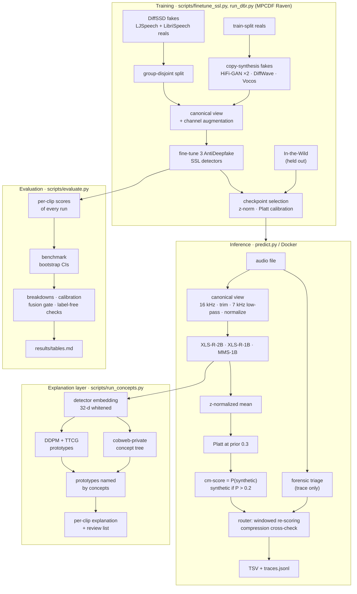

# HEARSAY · team SideQuests

Synthetic-speech detection for the NSA HEARSAY audio authentication challenge (HackGT 13). `predict.py` gives any audio
file a probability that it is synthetic, writes the challenge TSV, and records why in a per-file trace. A separate
concept-formation layer explains each decision in terms of learned concepts.

**Official score on the NSA test set** (organizers, hidden labels): **minDCF 0.0317 · EER 1.44%**. The best interim
leaderboard entry was 0.0584 / 2.5%. Deliverable: [`submission/SideQuests_predictions_final.tsv`](submission/SideQuests_predictions_final.tsv).

## Architecture



## Results

| | In-the-Wild clean | In-the-Wild perturbed | NSA test (official) |
|---|---|---|---|
| best pretrained detector (zero-shot XLS-R-2B) | 0.038 | 0.189 | – |
| **final ensemble** | **0.028** [0.017, 0.040] | **0.082** [0.064, 0.097] | **0.0317** (EER 1.44%) |
| concept-based scorer (TTCG), same clips as its detector | within ~0.01 of the detector | tie | explanations only |

minDCF: the organizers' metric (Pspoof 0.3, Cfa 4), lower is better, [95% bootstrap CI]. In-the-Wild is web speech
from sources none of our models saw. "Perturbed" means the same clips through codec, telephony, noise, reverb and
similar channel chains.

- **What made the difference:** copy-synthesis fakes reversed the out-of-domain decay of plain fine-tuning, and the
  three-backbone ensemble beat its best member.
- **The explanations:** they are faithful where they make a claim (92% of mixed explanations), stable across
  insertion orders (94–95%), and flagged a scoring bug.
- **Weak spots:** reverberation and clips under 2 s.

## Run it

```bash
python predict.py --input /path/to/audio --output out/ --template /path/to/HGT_Hearsay_score_template.csv
docker build -t sidequests-hearsay . && \
  docker run --rm --network none --memory 16g -v /path/to/audio:/data/input:ro -v $PWD/out:/data/output sidequests-hearsay
pytest tests --ignore=tests/dsp && pytest tests/dsp
```

`predict.py` needs `artifacts/diffusion/` (the three checkpoints and `fusion.json`) and about 15 GB of RAM. Everything
else, including training and evaluation on MPCDF Raven, is in [docs/REPRODUCE.md](docs/REPRODUCE.md).

## Documentation

| Document | Contents |
|---|---|
| [docs/APPROACH.md](docs/APPROACH.md) | the whole approach from first principles: the metric and Bayes decisions, data and shortcuts, the detector, COBWEB and prototype theory, diffusion prototypes (TTCG), the evaluation pipeline, results, references |
| [docs/EVALUATION.md](docs/EVALUATION.md) | protocol, the evaluation pipeline, the final test matrix, every result with intervals |
| [docs/DATA.md](docs/DATA.md) | data sources, the forensic audit, shortcut checks, splits, augmentation |
| [docs/REPRODUCE.md](docs/REPRODUCE.md) | environments, the Raven job sequence, Docker, runtime |
| [results/](results/) | generated tables and CSVs, concept outputs, one explanation per test clip |
| [docs/NSA_HackGT13_TechTalk.pdf](docs/NSA_HackGT13_TechTalk.pdf), [docs/HackGT13_Hearsay_challenge_brief.pdf](docs/HackGT13_Hearsay_challenge_brief.pdf) | the organizers' talk and brief |
| [docs/archive/](docs/archive/) | plans, handoffs, and what was removed in the consolidation |

## Repository

| Path | Contents |
|---|---|
| `predict.py`, `Dockerfile` | inference: TSV and traces |
| `hearsay/` | audio and canonical view, augmentation, manifests and splits, metric, TSV writer, AntiDeepfake port, concepts, diffusion (DDPM, TTCG, copy-synthesis), forensic triage |
| `hearsay_dsp/` | the signal-processing detector (evaluated, gated out of the score) |
| `scripts/` | pipeline stages: data, audit, fine-tuning, copy-synthesis, embeddings, concepts, evaluation, submission |
| `mpcdf/` | Raven job scripts and environment setup |
| `tests/` | unit tests |
| `submission/` | the final TSV, its summary, `fusion.json` |

## Credits

- AntiDeepfake detectors: Ge, Wang, Liu & Yamagishi (NII).
- cobweb-private: the Teachable AI Lab, Georgia Tech. Private, not redistributed here.
- TTCG and DMCF: Wang, Gupta, Zhu & MacLellan; Wang, Singaravadivelan & MacLellan.
- Data: DiffSSD, LJSpeech, LibriSpeech, In-the-Wild.

Full references are in [docs/APPROACH.md](docs/APPROACH.md#references).
